# Enterprise Agentic AI Microservices Architecture

## Complete End-to-End Architecture Diagram

```mermaid
graph TB
    %% External Layer
    subgraph "External Layer"
        USER[👤 User]
        API_CLIENT[📱 API Client]
        WEB_UI[🌐 Web UI]
    end

    %% API Gateway Layer
    subgraph "API Gateway Layer"
        API_GW[🚪 API Gateway<br/>Port: 8000<br/>- Authentication<br/>- Rate Limiting<br/>- Load Balancing<br/>- Request Routing]
    end

    %% Orchestration Layer
    subgraph "Orchestration Layer"
        ORCHESTRATOR[🎯 Orchestration Service<br/>Port: 8001<br/>- Pattern Management<br/>- Agent Coordination<br/>- Session Management<br/>- Real-time Streaming]
        
        subgraph "Orchestration Patterns"
            SEQ[📋 Sequential]
            CONC[⚡ Concurrent]
            HANDOFF[🔄 Handoff]
            GROUP[👥 Group Chat]
            MAGENTIC[🧲 Magentic]
        end
    end

    %% Agent Services Layer
    subgraph "Agent Services Layer"
        subgraph "Core Agents"
            RAG_AGENT[📚 RAG Agent<br/>Port: 8002<br/>- Document QA<br/>- Source Citation<br/>- Context Retrieval]
            
            SEARCH_AGENT[🔍 Search Agent<br/>Port: 8003<br/>- Web Search<br/>- Content Extraction<br/>- Result Validation]
            
            LLM_AGENT[🤖 LLM Agent<br/>Port: 8004<br/>- General AI Tasks<br/>- Text Generation<br/>- Conversation]
            
            JIRA_AGENT[📋 JIRA Agent<br/>Port: 8005<br/>- Issue Management<br/>- Project Tracking<br/>- Reporting]
            
            GITLAB_AGENT[🔧 GitLab Agent<br/>Port: 8006<br/>- Code Management<br/>- CI/CD Integration<br/>- Repository Operations]
        end
        
        subgraph "Template Agent"
            TEMPLATE_AGENT[📝 Template Agent<br/>Port: 8007<br/>- Dynamic Agent Creation<br/>- Custom Workflows<br/>- Extensible Patterns]
        end
    end

    %% Infrastructure Layer
    subgraph "Infrastructure Layer"
        subgraph "Service Discovery"
            CONSUL[🔍 Consul<br/>Port: 8500<br/>- Service Registry<br/>- Health Checks<br/>- Load Balancing<br/>- Configuration]
        end
        
        subgraph "Data Layer"
            POSTGRES[(🗄️ PostgreSQL<br/>Port: 5432<br/>- Session Data<br/>- Agent History<br/>- Orchestration Logs)]
            
            REDIS[(⚡ Redis<br/>Port: 6379<br/>- Caching<br/>- Session Storage<br/>- Real-time Data)]
        end
        
        subgraph "Message Layer"
            RABBITMQ[🐰 RabbitMQ<br/>Port: 5672<br/>- Message Queuing<br/>- Event Streaming<br/>- Inter-service Communication]
        end
        
        subgraph "Monitoring"
            PROMETHEUS[📊 Prometheus<br/>Port: 9090<br/>- Metrics Collection<br/>- Performance Monitoring]
            
            GRAFANA[📈 Grafana<br/>Port: 3000<br/>- Dashboards<br/>- Visualization]
        end
    end

    %% External Services
    subgraph "External Services"
        OPENAI[🧠 OpenAI API<br/>- GPT Models<br/>- Embeddings<br/>- Function Calling]
        
        JIRA_API[📋 JIRA API<br/>- Issue Management<br/>- Project Data]
        
        GITLAB_API[🔧 GitLab API<br/>- Repository Access<br/>- CI/CD Data]
        
        WEB_SEARCH[🌐 Web Search APIs<br/>- Google Search<br/>- Bing Search<br/>- Custom APIs]
    end

    %% Data Flow Connections
    USER --> API_CLIENT
    USER --> WEB_UI
    API_CLIENT --> API_GW
    WEB_UI --> API_GW

    %% API Gateway to Orchestrator
    API_GW --> ORCHESTRATOR

    %% Orchestrator to Patterns
    ORCHESTRATOR --> SEQ
    ORCHESTRATOR --> CONC
    ORCHESTRATOR --> HANDOFF
    ORCHESTRATOR --> GROUP
    ORCHESTRATOR --> MAGENTIC

    %% Orchestrator to Agents
    ORCHESTRATOR --> RAG_AGENT
    ORCHESTRATOR --> SEARCH_AGENT
    ORCHESTRATOR --> LLM_AGENT
    ORCHESTRATOR --> JIRA_AGENT
    ORCHESTRATOR --> GITLAB_AGENT
    ORCHESTRATOR --> TEMPLATE_AGENT

    %% Service Discovery
    CONSUL -.-> API_GW
    CONSUL -.-> ORCHESTRATOR
    CONSUL -.-> RAG_AGENT
    CONSUL -.-> SEARCH_AGENT
    CONSUL -.-> LLM_AGENT
    CONSUL -.-> JIRA_AGENT
    CONSUL -.-> GITLAB_AGENT
    CONSUL -.-> TEMPLATE_AGENT

    %% Data Connections
    ORCHESTRATOR --> POSTGRES
    ORCHESTRATOR --> REDIS
    ORCHESTRATOR --> RABBITMQ

    RAG_AGENT --> POSTGRES
    RAG_AGENT --> REDIS
    SEARCH_AGENT --> REDIS
    LLM_AGENT --> REDIS
    JIRA_AGENT --> POSTGRES
    GITLAB_AGENT --> POSTGRES

    %% External API Connections
    RAG_AGENT --> OPENAI
    SEARCH_AGENT --> OPENAI
    SEARCH_AGENT --> WEB_SEARCH
    LLM_AGENT --> OPENAI
    JIRA_AGENT --> JIRA_API
    GITLAB_AGENT --> GITLAB_API

    %% Monitoring
    PROMETHEUS -.-> API_GW
    PROMETHEUS -.-> ORCHESTRATOR
    PROMETHEUS -.-> RAG_AGENT
    PROMETHEUS -.-> SEARCH_AGENT
    PROMETHEUS -.-> LLM_AGENT
    PROMETHEUS -.-> JIRA_AGENT
    PROMETHEUS -.-> GITLAB_AGENT

    GRAFANA --> PROMETHEUS

    %% Styling
    classDef userLayer fill:#e1f5fe
    classDef apiLayer fill:#f3e5f5
    classDef orchestrationLayer fill:#fff3e0
    classDef agentLayer fill:#e8f5e8
    classDef infrastructureLayer fill:#fce4ec
    classDef externalLayer fill:#f1f8e9

    class USER,API_CLIENT,WEB_UI userLayer
    class API_GW apiLayer
    class ORCHESTRATOR,SEQ,CONC,HANDOFF,GROUP,MAGENTIC orchestrationLayer
    class RAG_AGENT,SEARCH_AGENT,LLM_AGENT,JIRA_AGENT,GITLAB_AGENT,TEMPLATE_AGENT agentLayer
    class CONSUL,POSTGRES,REDIS,RABBITMQ,PROMETHEUS,GRAFANA infrastructureLayer
    class OPENAI,JIRA_API,GITLAB_API,WEB_SEARCH externalLayer
```



## Architecture Components

### 🚪 API Gateway (Port 8000)
- **Authentication & Authorization**: JWT-based security
- **Rate Limiting**: Request throttling and burst protection
- **Load Balancing**: Intelligent request distribution
- **Request Routing**: Dynamic service discovery routing
- **Middleware**: Logging, monitoring, and error handling

### 🎯 Orchestration Service (Port 8001)
- **Pattern Management**: Sequential, Concurrent, Handoff, Group Chat, Magentic
- **Agent Coordination**: Multi-agent workflow orchestration
- **Session Management**: User session and context persistence
- **Real-time Streaming**: WebSocket-based live updates
- **Enterprise Features**: Handoff chains, group collaboration, consensus building

### 🤖 Agent Services (Ports 8002-8007)

#### 📚 RAG Agent (Port 8002)
- **Document QA**: Intelligent document-based question answering
- **Source Citation**: Accurate source attribution and references
- **Context Retrieval**: Semantic search and context extraction

#### 🔍 Search Agent (Port 8003)
- **Web Search**: Multi-engine web search capabilities
- **Content Extraction**: Intelligent content parsing and summarization
- **Result Validation**: Quality assessment and filtering

#### 🤖 LLM Agent (Port 8004)
- **General AI Tasks**: Versatile AI assistance
- **Text Generation**: Creative and analytical writing
- **Conversation**: Natural language interaction

#### 📋 JIRA Agent (Port 8005)
- **Issue Management**: Create, update, and track issues
- **Project Tracking**: Progress monitoring and reporting
- **Workflow Automation**: JIRA workflow integration

#### 🔧 GitLab Agent (Port 8006)
- **Code Management**: Repository operations and analysis
- **CI/CD Integration**: Pipeline monitoring and management
- **Repository Operations**: Branch, merge, and deployment management

#### 📝 Template Agent (Port 8007)
- **Dynamic Agent Creation**: Runtime agent instantiation
- **Custom Workflows**: Extensible pattern implementation
- **Extensible Patterns**: Plugin-based architecture

### 🏗️ Infrastructure Services

#### 🔍 Consul (Port 8500)
- **Service Registry**: Automatic service discovery
- **Health Checks**: Continuous service monitoring
- **Load Balancing**: Intelligent traffic distribution
- **Configuration**: Centralized configuration management

#### 🗄️ PostgreSQL (Port 5432)
- **Session Data**: User session persistence
- **Agent History**: Execution logs and metrics
- **Orchestration Logs**: Workflow execution tracking

#### ⚡ Redis (Port 6379)
- **Caching**: High-performance data caching
- **Session Storage**: Fast session management
- **Real-time Data**: Live data synchronization

#### 🐰 RabbitMQ (Port 5672)
- **Message Queuing**: Reliable message delivery
- **Event Streaming**: Real-time event processing
- **Inter-service Communication**: Asynchronous messaging

#### 📊 Monitoring Stack
- **Prometheus (Port 9090)**: Metrics collection and storage
- **Grafana (Port 3000)**: Visualization and dashboards

### 🌐 External Services
- **OpenAI API**: GPT models, embeddings, function calling
- **JIRA API**: Issue management and project data
- **GitLab API**: Repository access and CI/CD data
- **Web Search APIs**: Google, Bing, and custom search services

## Data Flow Patterns

### 1. Sequential Pattern
```
User → API Gateway → Orchestrator → Agent1 → Agent2 → Agent3 → Response
```

### 2. Concurrent Pattern
```
User → API Gateway → Orchestrator → [Agent1, Agent2, Agent3] → Response
```

### 3. Handoff Pattern
```
User → API Gateway → Orchestrator → Agent1 → Context → Agent2 → Response
```

### 4. Group Chat Pattern
```
User → API Gateway → Orchestrator → [Agent1, Agent2, Agent3] → Discussion → Consensus → Response
```

### 5. Magentic Pattern
```
User → API Gateway → Orchestrator → Dynamic Agent Selection → Response
```

## Security & Monitoring

### 🔐 Security Features
- **JWT Authentication**: Secure token-based authentication
- **Rate Limiting**: DDoS protection and resource management
- **Input Validation**: Comprehensive request validation
- **Audit Logging**: Complete operation tracking

### 📊 Monitoring & Observability
- **Health Checks**: Continuous service health monitoring
- **Metrics Collection**: Performance and usage metrics
- **Distributed Tracing**: End-to-end request tracking
- **Real-time Dashboards**: Live system monitoring

## Deployment Architecture

### 🐳 Docker Containers
- Each service runs in isolated Docker containers
- Multi-stage builds for optimized images
- Health checks and graceful shutdowns

### ☸️ Kubernetes Ready
- Complete Kubernetes manifests provided
- Horizontal Pod Autoscaling (HPA)
- Service mesh integration ready
- ConfigMaps and Secrets management

### 🔄 CI/CD Integration
- GitLab CI/CD pipeline support
- Automated testing and deployment
- Blue-green deployment strategies
- Rollback capabilities

## Scalability Features

### 📈 Horizontal Scaling
- Stateless service design
- Load balancer integration
- Auto-scaling based on metrics
- Service mesh communication

### 🚀 Performance Optimization
- Redis caching layer
- Database connection pooling
- Asynchronous processing
- Real-time streaming capabilities

This architecture provides a robust, scalable, and maintainable foundation for enterprise-grade agentic AI applications with comprehensive monitoring, security, and operational capabilities.
